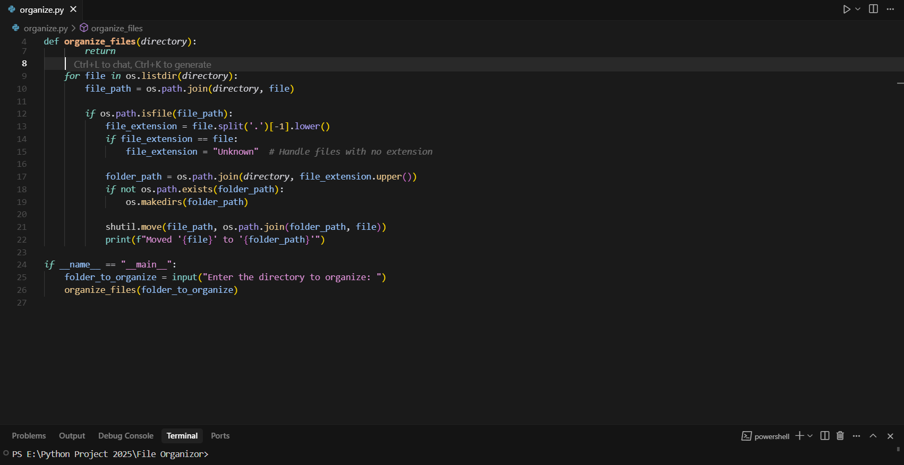

# 🗂️ Smart File Organizer

A powerful, minimalistic tool to automatically organize your messy files into well-structured folders. Whether it's downloads, documents, images, or code — this script declutters your directories in seconds.

---

## ✨ Features

- 🔍 Scans specified directories for files
- 📁 Automatically categorizes files by type (e.g., images, videos, documents, etc.)
- 🧠 Intelligent sub-folder creation based on extensions
- ♻️ Prevents duplicates and handles naming conflicts
- ⏱️ Quick, efficient, and easy to run
- 🛠️ Fully customizable (you can define your own file-type mappings)

---

## 🚀 Getting Started

##IMAGE

!

### Prerequisites

- Python 3.x installed
- Basic command line knowledge

### Installation

1. **Clone the repository**

```bash
git clone https://github.com/yourusername/file-organizer.git
cd file-organizer
